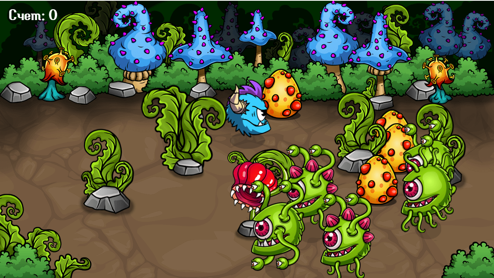

# Игра на физику

Проект на GH-pages:  https://ilia-puchkov.github.io/pet-game/

Игра, в которой игроку предстоит взаимодействовать с различными предметами. Возможно отталкивать некоторые препятствия, противников и союзников.
Проект, использованный, чтобы опробовать работу с Canvas и возможность создания элементов через код.

Используемые технологии:
* Javascript
* HTML
* CSS

Статус: в процессе

Задачи:
* продумать возможность работы с другими разрешениями
* добавить новых противников
* продумать возможность влияния игрока на противников и наоборот
